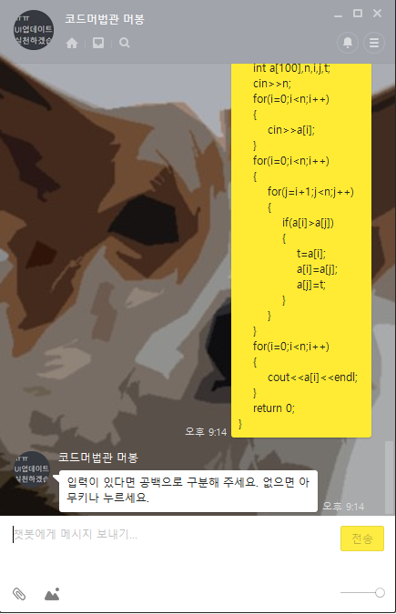

# Online Compiler Kakao plusfriend

> 프로그램 종류 : 웹 서비스, API, 카카오톡 봇
>
> 사용 언어 : PHP
>
> 프로젝트 소스 링크 : https://github.com/murbong/Murbong-Kakao-Compiler
>
>
> 지원하는 언어 : C, C++, C++11, C#, JAVA, Python2, Python3, Lua
>
> 참조 프로젝트 : https://github.com/shawon100/Online-Compiler/


## 설명

> 카카오톡 플러스친구를 이용해 온라인 컴파일을 해보는 것은 어떨까?


플러스친구와 채팅을 하면 언어를 선택할 수 있는 메인 메뉴가 뜬다. 여기서 C를 눌러보겠다.


그다음 보낼 메시지는 Code 메시지로, 원하는 언어에 맞는 코드를 적어서 전송하면 된다. 본인은 C++을 이용해 Bubble sort를 구현해 보겠다. 

```c++
#include <iostream>
#include <bits/stdc++.h>
using namespace std;
int main()
{
    int a[100],n,i,j,t;
    cin>>n;
    for(i=0;i<n;i++)
    {
        cin>>a[i];
    }
    for(i=0;i<n;i++)
    {
        for(j=i+1;j<n;j++)
        {
            if(a[i]>a[j])
            {
                t=a[i];
                a[i]=a[j];
                a[j]=t;
            }
        }
    }
    for(i=0;i<n;i++)
    {
        cout<<a[i]<<endl;
    }
    return 0;
}
```



이런 다음, cin에 알맞는 입력값을 메시지로 전송한다.


그러면 출력값과 재밌는 이모티콘이 나오게 된다. 

만약 코딩을 하다 끝내고 싶다면, ‘끝내기’, 또는 ‘exit’ 를 타이핑하면 된다.


## 소스코드


> 본 소스코드는 Linux Subsystem에서 구현되어있습니다. 


카카오톡 API는 JSON으로 데이터를 주고받는데, 사용자가 채팅방에서 채팅을 하면, 이러한 형식으로 POST한다.

- **Method** : POST
- **URL** : http(s)://:your_server_url/message
- **Content - Type** : application/json; charset=utf-8
- **Parameters**

| 필드명   | 타입   | 필수여부 | 설명                                                 |
| :------- | ------ | -------- | ---------------------------------------------------- |
| user_key | String | Required | 메시지를 발송한 유저 식별 키                         |
| type     | String | Required | text, photo                                          |
| content  | String | Required | 자동응답 명령어의 메시지 텍스트 혹은 미디어 파일 uri |

그러면, 서버에서는 이러한 형식으로 응답해줘야한다.

**Response**

| 필드명   | 타입                                                         | 필수여부 | 설명                                                         |
| -------- | ------------------------------------------------------------ | -------- | ------------------------------------------------------------ |
| message  | [Message](https://github.com/plusfriend/auto_reply/blob/master/README.md#62-message) | Required | 자동응답 명령어에 대한 응답 메시지의 내용. 6.2에서 상세 기술 |
| keyboard | [Keyboard](https://github.com/plusfriend/auto_reply#6-object) | Optional | 키보드 영역에 표현될 명령어 버튼에 대한 정보. 생략시 text 타입(주관식 답변 키보드)이 선택된다. 6.1에서 상세 기술 |

> 카카오톡 API Document에서 발췌.


서버에서 응답을 하는 방법은 여러가지인데, 본인은 PHP로 구현했다.

> message.php


$arr 테이블을 만든 뒤, json_encode를 이용하여 카카오 api 응답 형식에 맞게 출력한다.

여기서, ‘어떻게 하면 php가 전에 입력했던 값을 기억하는가?‘ 를 생각해 보았는데, 파일로 이전 값을 저장하는 방식으로 구현했다. 

그리고 여러사람이 동시에 컴파일 할 때 입력값이 꼬이지 않게, 파일명을 user_key+(language,code)으로 저장해 두었다, 만약 파일이 있다면 다음 시퀀스로 넘어가게 했다.

만약 사용자가 ‘끝내기’, ‘exit’을 말한다면 모든 상황이 초기화된다.


초기에 언어를 설정해서, userkey+lang 파일에 c라는 문자를 저장한다.


만약 아직 userkey+code 파일이 없다면, 사용자가 다음에 전송한 메시지는 code가 되어 파일로 저장된다.

그런다음 입력하라는 메시지를 출력한다.

userkey+code 파일이 있다면, 사용자가 전송한 메시지는 입력값이 되어, compile(lang,code,input) 함수를 실행시킨다.

> compile 함수는 require한 compile.php에 선언되어있다.

전송이 완료되었으면, userkey+code 파일을 지운 뒤, 다시 code를 받는 상태로 돌아간다.

사용자가 ‘끝내기’, ‘exit’를 타이핑하면 어떤 상태여도 userkey 파일을 지운 뒤, 메인 메뉴를 출력한다.


> compile.php


compile.php는 또 여러개의 컴파일 시퀀스를 가지고 있는 php로 나뉘어져 있다.

php에서 POST를 하면, include 한 php 내부에서도 POST값을 받아올 수 있다.

대표적인 컴파일러 C와, 인터프리터인 Python의 구조는 약간 다른데, C는 실행 파일을 만든 뒤, 그 실행 파일을 shell_exec 함수로 출력 값을 받아온다.

인터프리터인 Python은 바로 코드를 실행하여 shell_exec 함수로 출력 값을 받아온다.

> 자세한 코드는 https://github.com/shawon100/Online-Compiler/ 에 있습니다.


### 그런데...

앞서 말했듯이, 카카오톡 api의 응답 요청은 http(s)://:your_server_url/message 형식으로 되어있다.

message.php가 아닌 message로 응답이 되게 만들어야한다.

찾아보니, apache에서는 .htaccess를 이용해 rewrite를 할 수 있다. keyboard.php와 message.php가 있는 디렉토리에 .htaccess 파일을 만든뒤

```
RewriteEngine On
RewriteBase /

RewriteCond %{THE_REQUEST} ^[A-Z]{3,}\s([^.]+)\.php [NC]
RewriteRule ^ %1 [R,L,NC]

RewriteCond %{REQUEST_FILENAME}.php -f
RewriteRule ^ %{REQUEST_URI}.php [L]
```

간략히 말해, php가 확장자로 붙어있으면, 확장자를 제거한다.


## 보안과 취약점

모든 컴파일은 무한루프를 방지하기 위해 timeout을 설정했으며, 사용자가 악의적인 목적으로 코드를 컴파일 하는 경우도 있다.

```c
#include <stdlib.h>

int main(){
system(“rm rf /”);

}
```

이러한 현상을 방지하기 위해, 윈도우 서버 대신 리눅스 서브시스템을 사용하여 메인 서버가 파괴될 가능성을 방지했다.

또한 리눅스 내부에서 권한을 수정하여, root가 아니면 파일을 삭제하거나 수정할 수 없게 만들었다.

> chmod 755 filename 을 사용하여, 다른 사용자의 쓰기 활동을 방지했다.

